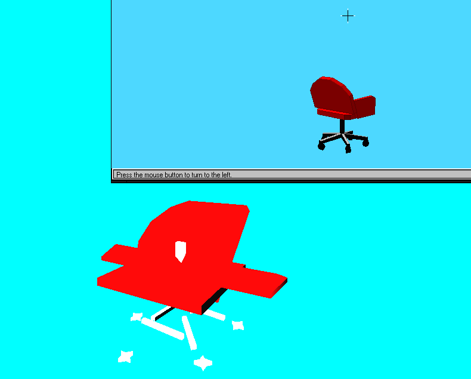
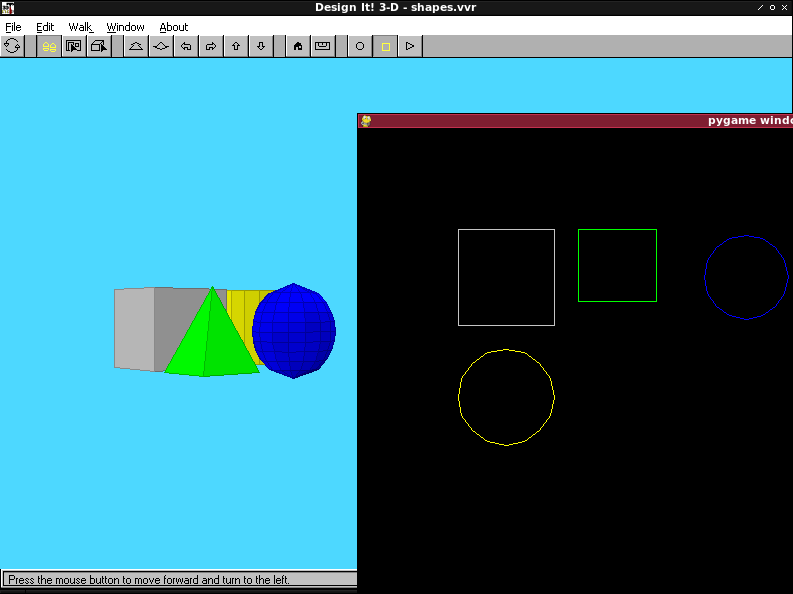

# Virtus VR File Format

This is a collection of notes and experimentation regarding the Virtus VR 3D object file format, featured (among other places) in the Windows 3.x/Mac Classic program Design-It 3D!

This information has been gathered through reverse engineering techniques. It is *very* work-in-progress and probably iffy. A lot of functionality was determined by changing numbers and seeing what happened when the file was reloaded in D3D.

## ImHex

A WIP pattern for [ImHex](https://docs.werwolv.net/imhex) is available as `vvr.hexpat`. This pattern gives a rough idea of which parts of the file are which according to current understanding.

## C Utilities

A simple C program `dump` is available which can dump the contents of VVR files, along with a few sample VVR files. `render` will attempt to render the VVR file using OpenGL. These can be compiled with `make`, if the `libopengl-dev` and `libglut-dev` packages are available.

